## Задание

В работе реализованы три алгоритма:

1. `extendible hashing` на файловой системе с операциями `Build`, `Get`, `Insert`, `Update`, `Delete`
2. `perfect hash` для фиксированного набора ключей с операциями `Build`, `Get`
3. `LSH` для поиска near-duplicate текстов с операциями `Build`, `Add`, `FindDuplicates`, `FullScanDuplicates`

## Реализация

### Perfect Hash

Реализация находится в `lab-1-perfect/perfect/`.

Использована двухуровневая схема:

1. на первом уровне подбирается `primarySeed`, минимизирующий сумму квадратов размеров бакетов;
2. для каждого бакета второго уровня строится собственная collision-free таблица;
3. для бакетов размера `m > 1` выделяется `m^2` слотов.

Ключевые свойства реализации:

1. структура immutable после построения;
2. lookup выполняется за одну primary и одну secondary хеш-функцию;

### LSH

Реализация находится в `lab-1-lsh/lsh/`.

Использована схема:

1. текст разбивается на токены;
2. из токенов строятся shingles фиксированного размера;
3. по shingles считается MinHash signature;
4. signature режется на bands;
5. документы попадают в band buckets;
6. `FindDuplicates` ищет кандидатов через LSH buckets, а `FullScanDuplicates` проверяет все документы полным проходом.

Ключевые свойства реализации:

1. индекс поддерживает `Build` и инкрементальный `Add`;
2. `FindDuplicates` является ускоренным query path;
3. `FullScanDuplicates` нужен как baseline.

### Extendible Hashing

Реализация находится в `lab-1-extendible/extendible/`.

Использована схема:

1. directory с `global depth`;
2. buckets с `local depth`;
3. split при переполнении бакета;
4. merge и shrink directory при удалении;
5. хранение `meta.dat` и `bucket_*.dat` на диске.

Ключевые свойства реализации:

1. `Put` и `Delete` помечают bucket/meta как dirty и накапливают счетчик изменений
2. `Sync()` вызывается внутри таблицы по условию: после накопления достаточного числа мутаций или dirty-файлов
3. `Close()` остается обязательной финальной
4. `mmapCache.write()` только обновляет mmap-region и ставит `dirty = true`, а `msync` вызывается позже при flush dirty-region
5. уже загруженные бакеты кэшируются в `ht.buckets`

## Методика измерений

Система: Intel® Core™ Ultra 7 255H × 16; 32GB RAM

Все benchmark-артефакты лежат в `artifacts/benchmarks/`.

1. `PerfectBuild`, `LSHBuild`, `LSHAdd`, `LSHFullScanDuplicates`: `10` прогонов
2. `PerfectGet`, `LSHFindDuplicates`: `15` прогонов
3. `ExtendibleBuild`, `ExtendibleGet`, `ExtendibleInsert`, `ExtendibleUpdate`, `ExtendibleDelete`: `5` прогонов

1. `runs` — число независимых прогонов benchmark'а;
2. `mean` — среднее значение по прогонам;
3. `stdev` — стандартное отклонение по прогонам.

## Результаты: Perfect Hash

### BenchmarkPerfectBuild

| Size | Runs | Mean items/s | Mean ns/item | Stdev ns/item |
|---|---:|---:|---:|---:|
| `10000` | `10` | `2,117,018` | `514.02` | `146.75` |
| `50000` | `10` | `1,922,842` | `583.02` | `197.80` |
| `100000` | `10` | `1,665,031` | `610.73` | `87.66` |
| `250000` | `10` | `1,771,119` | `585.89` | `119.79` |

Графики:

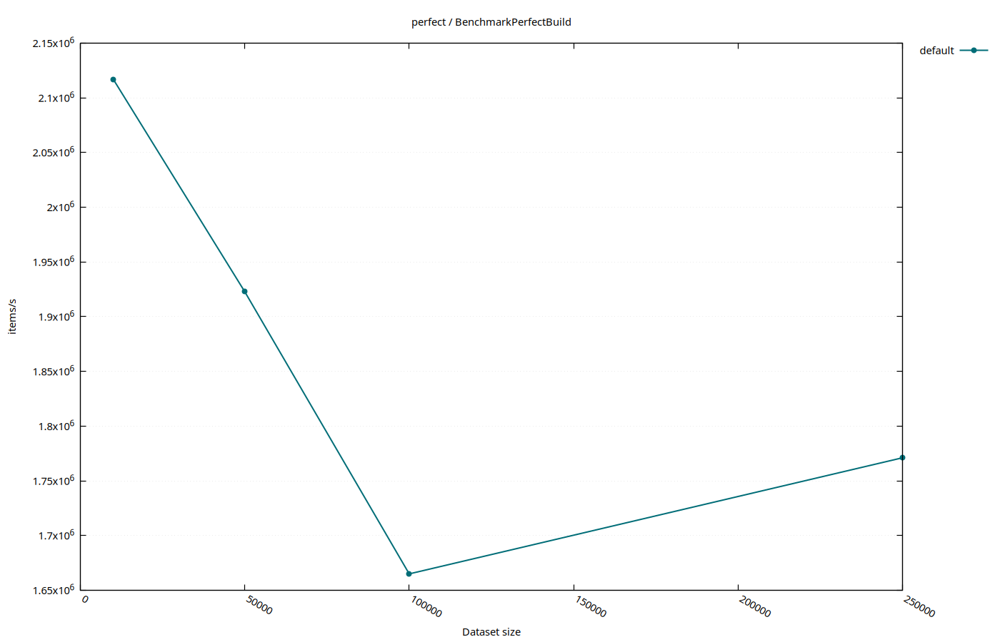

Профили:

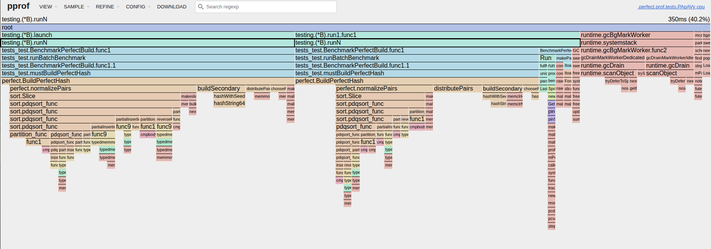
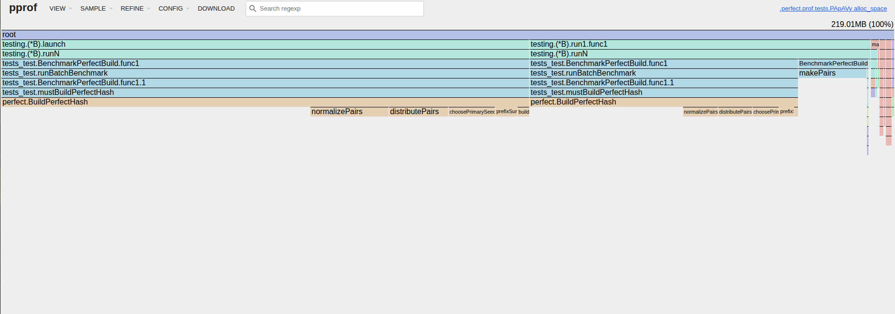

### BenchmarkPerfectGet

| Size | Runs | Mean ops/s | Mean ns/op | Stdev ns/op |
|---|---:|---:|---:|---:|
| `10000` | `15` | `21,141,801` | `49.35` | `11.54` |
| `50000` | `15` | `16,249,017` | `74.74` | `35.01` |
| `100000` | `15` | `4,479,100` | `230.11` | `40.26` |
| `250000` | `15` | `2,788,784` | `359.62` | `19.75` |

Графики:

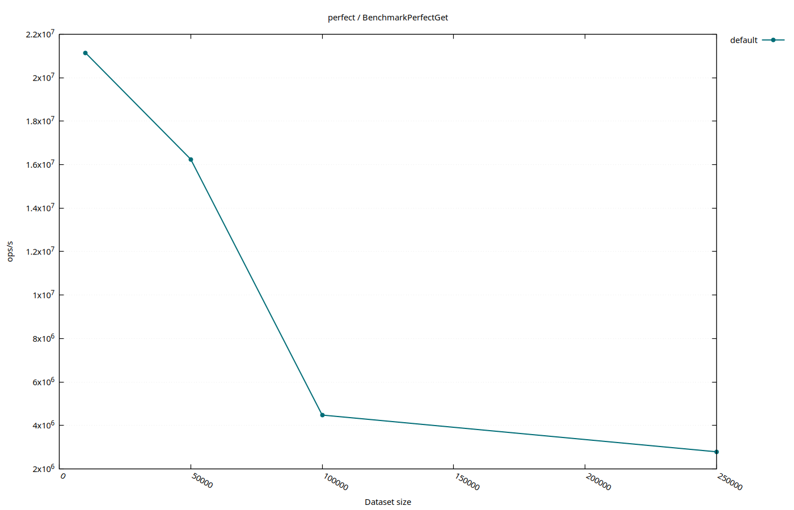

Профили:

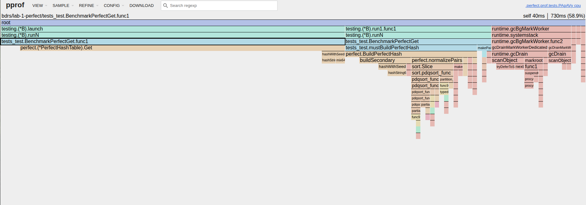
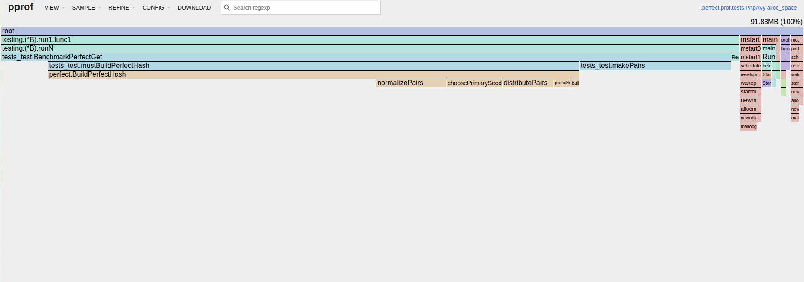

### Вывод по Perfect Hash

1. Построение близко к линейному по числу ключей.
2. `Get` очень быстрый и без аллокаций, но на больших таблицах заметно влияние cache locality.
3. Основной компромисс классический: дорогое построение в обмен на очень быстрый lookup.

## Результаты: LSH

### BenchmarkLSHBuild

| Size | Runs | Mean docs/s | Mean ns/doc | Stdev ns/doc |
|---|---:|---:|---:|---:|
| `10000` | `10` | `117,355` | `8583.80` | `764.53` |
| `50000` | `10` | `142,391` | `7103.80` | `758.58` |
| `100000` | `10` | `151,628` | `6650.70` | `660.87` |
| `250000` | `10` | `154,155` | `6493.30` | `214.28` |

Графики:

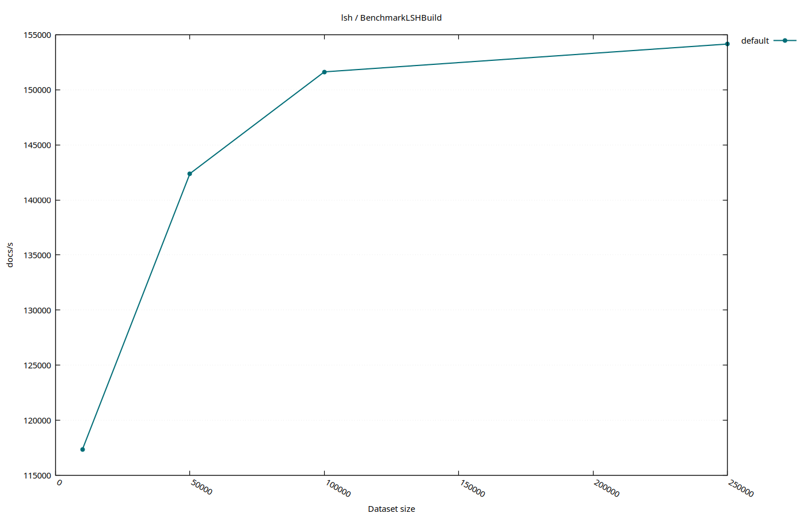

Профили:

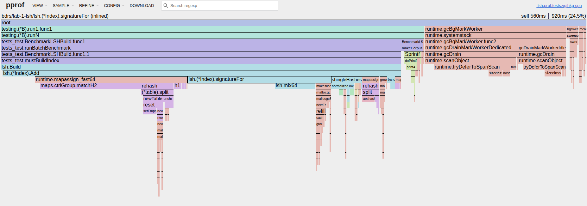
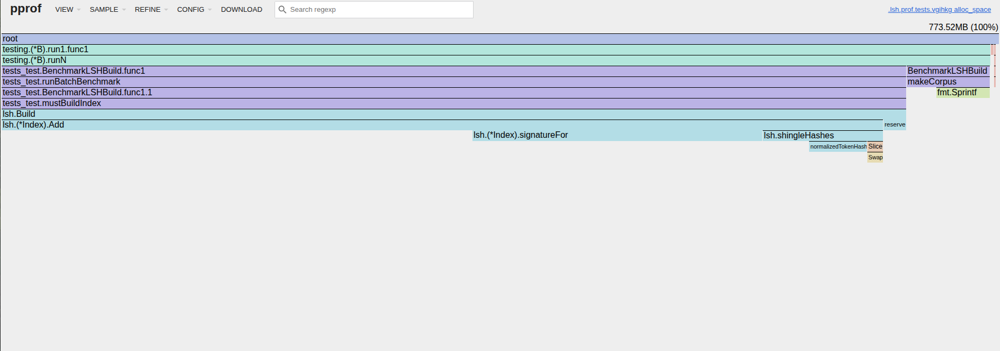

### BenchmarkLSHAdd

| Size | Runs | Mean docs/s | Mean ns/doc | Stdev ns/doc |
|---|---:|---:|---:|---:|
| `10000` | `10` | `107,451` | `9581.90` | `1826.96` |
| `50000` | `10` | `157,502` | `6409.60` | `659.62` |
| `100000` | `10` | `159,769` | `6296.50` | `549.76` |
| `250000` | `10` | `92,396` | `10930.40` | `1148.30` |

Графики:

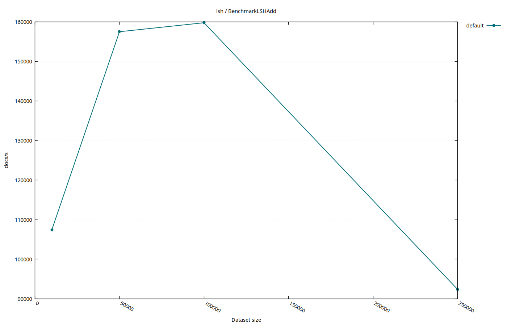

Профили:

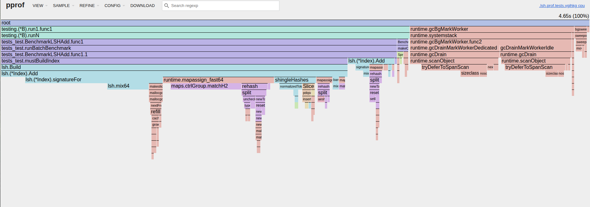
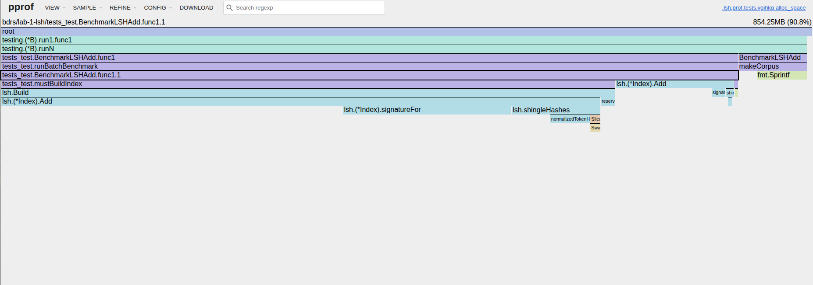

### BenchmarkLSHFindDuplicates

| Size | Runs | Mean ops/s | Mean ns/op | Stdev ns/op |
|---|---:|---:|---:|---:|
| `10000` | `15` | `155,027` | `9478.00` | `5374.06` |
| `50000` | `15` | `16,010` | `67760.27` | `20683.79` |
| `100000` | `15` | `7,231` | `143619.40` | `29071.59` |
| `250000` | `15` | `3,745` | `268051.93` | `16833.09` |

Графики:

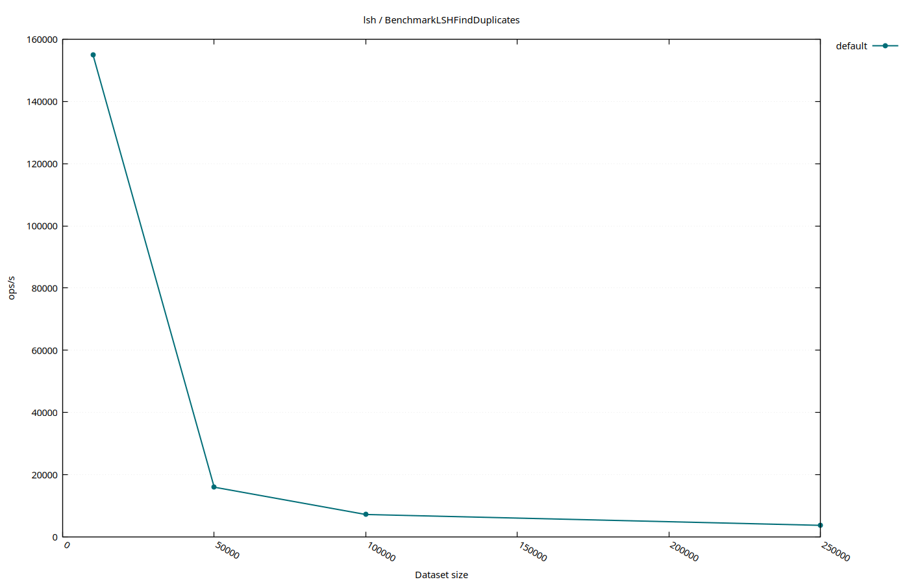

Профили:

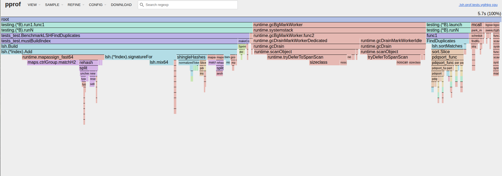
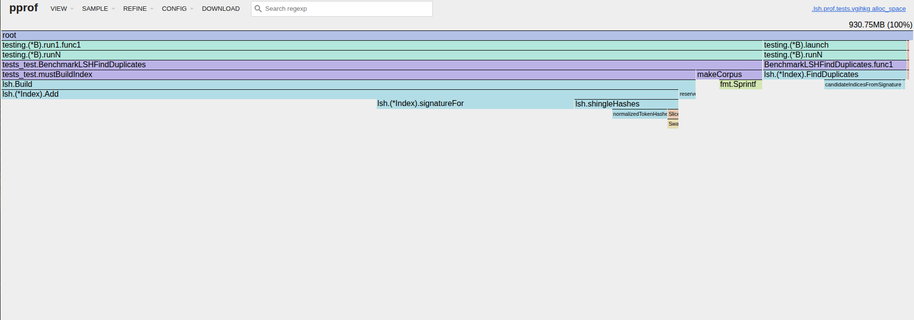

### BenchmarkLSHFullScanDuplicates

| Size | Runs | Mean ops/s | Mean ns/op | Stdev ns/op |
|---|---:|---:|---:|---:|
| `10000` | `10` | `934` | `1094618.00` | `165047.71` |
| `50000` | `10` | `304` | `3444945.40` | `734186.70` |
| `100000` | `10` | `166` | `6115525.50` | `722007.13` |
| `250000` | `10` | `74` | `13644190.70` | `1335304.52` |

Графики:

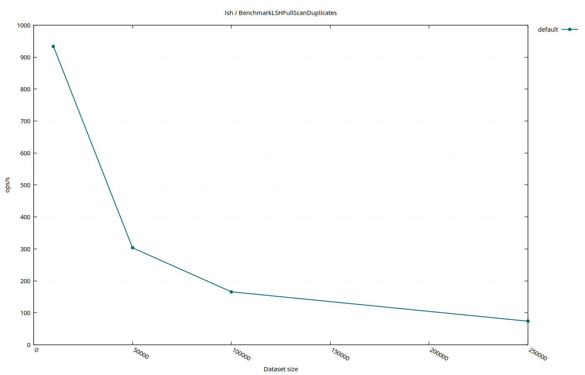

Профили:

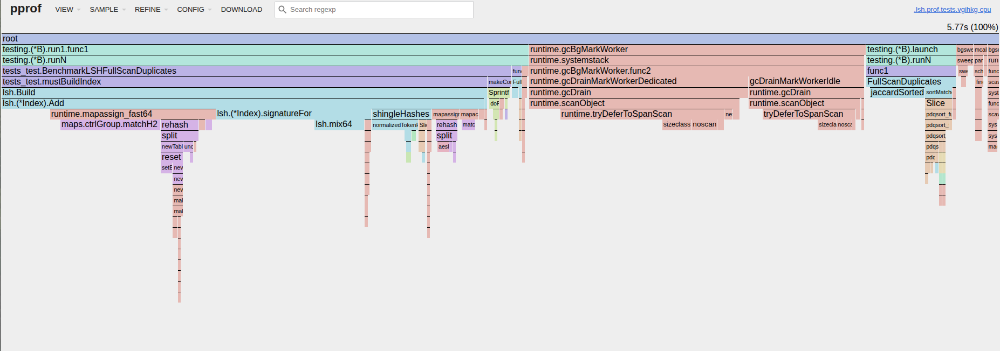
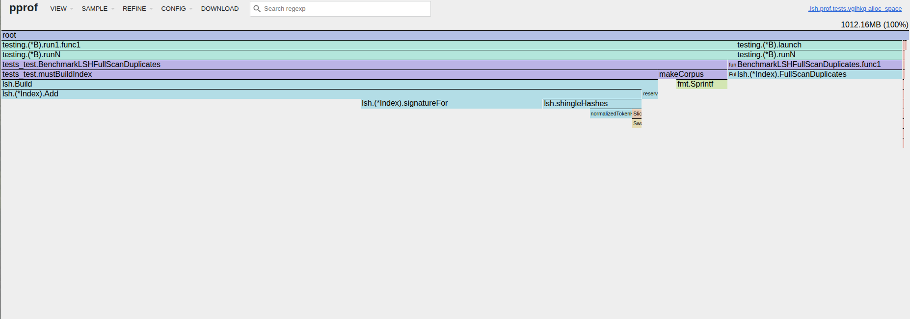

### Вывод по LSH

1. `Build` и `Add` ведут себя близко к линейному росту по объему корпуса.
2. `FindDuplicates` на всех размерах на порядки быстрее полного сканирования.
3. На `250000` документов `FindDuplicates` дает около `3745 ops/s`, а `FullScanDuplicates` только `73.89 ops/s`, то есть ускорение примерно в `50.7x`.
4. Цена ускорения — более тяжелое построение и заметное потребление памяти под индекс и band buckets.

## Результаты: Extendible Hashing

### BenchmarkExtendibleBuild
| Size | Limit | Runs | Mean ops/s | Mean ns/item |
|---|---:|---:|---:|---:|
| `10000` | `32` | `5` | `14,920` | `67364.00` |
| `10000` | `64` | `5` | `35,348` | `28447.80` |
| `10000` | `128` | `5` | `92,554` | `10815.20` |
| `50000` | `32` | `5` | `12,635` | `79168.20` |
| `50000` | `64` | `5` | `17,512` | `57185.20` |
| `50000` | `128` | `5` | `23,546` | `42801.40` |
| `100000` | `32` | `5` | `11,837` | `84618.20` |
| `100000` | `64` | `5` | `15,484` | `64718.60` |
| `100000` | `128` | `5` | `20,004` | `50018.80` |
| `250000` | `32` | `5` | `10,967` | `91214.20` |
| `250000` | `64` | `5` | `14,789` | `67630.80` |
| `250000` | `128` | `5` | `17,049` | `58683.40` |

Графики:

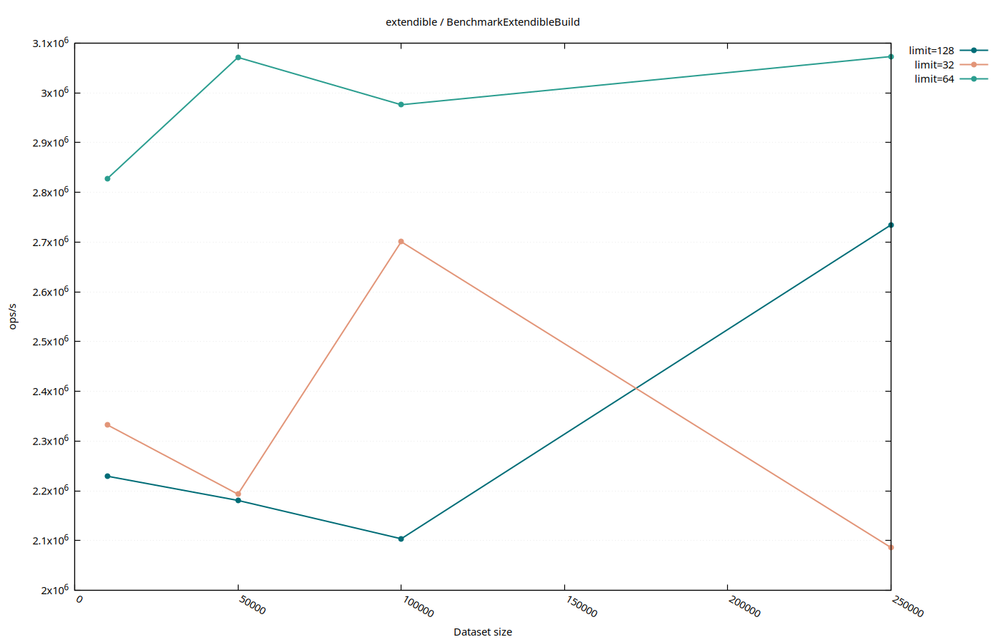

Профили:

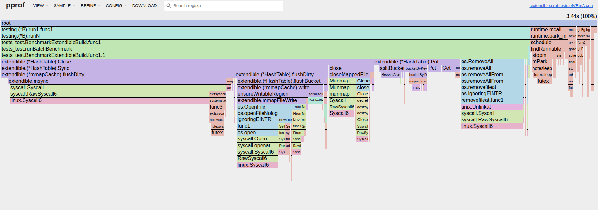
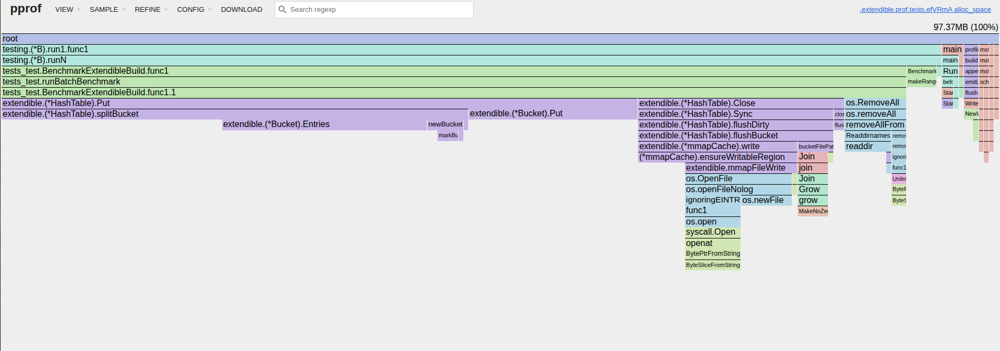

### BenchmarkExtendibleGet

| Size | Limit | Runs | Mean ops/s | Mean ns/op |
|---|---:|---:|---:|---:|
| `10000` | `32` | `5` | `6,370,028` | `177.59` |
| `10000` | `64` | `5` | `11,815,529` | `92.29` |
| `10000` | `128` | `5` | `7,680,033` | `133.44` |
| `50000` | `32` | `5` | `2,528,613` | `405.88` |
| `50000` | `64` | `5` | `3,247,558` | `328.58` |
| `50000` | `128` | `5` | `4,198,025` | `245.48` |
| `100000` | `32` | `5` | `1,608,197` | `649.58` |
| `100000` | `64` | `5` | `3,652,105` | `307.96` |
| `100000` | `128` | `5` | `5,258,953` | `198.44` |
| `250000` | `32` | `5` | `911,933` | `1163.16` |
| `250000` | `64` | `5` | `1,788,771` | `588.38` |
| `250000` | `128` | `5` | `2,490,662` | `418.16` |

Графики:

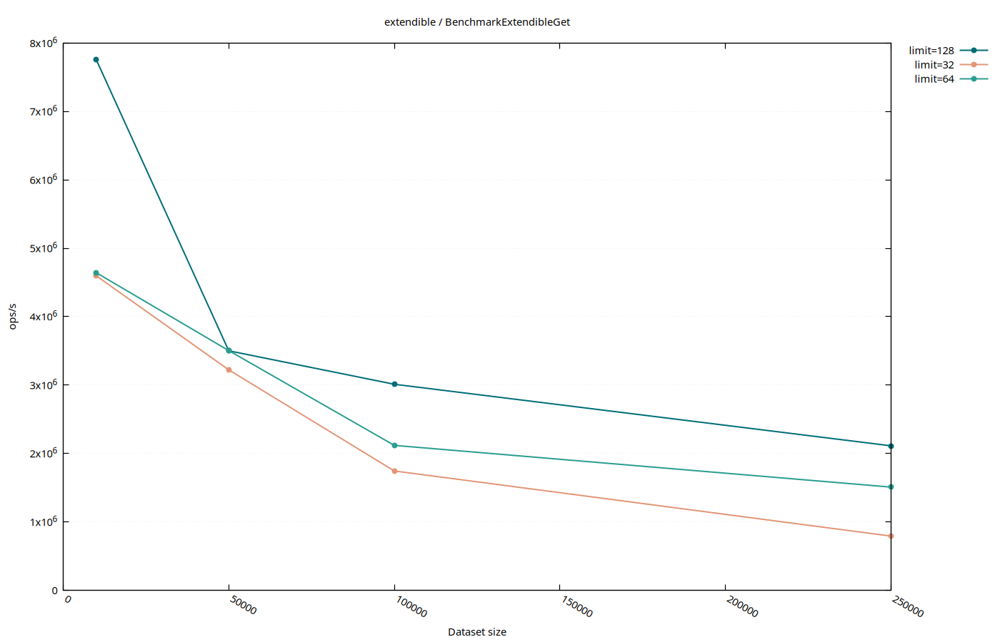

Профили:

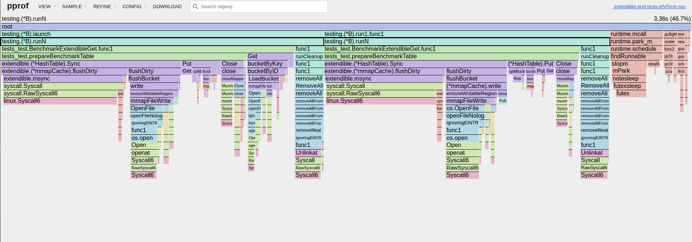
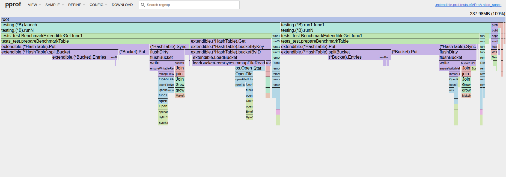

### BenchmarkExtendibleInsert

| Size | Limit | Runs | Mean ops/s | Mean ns/item |
|---|---:|---:|---:|---:|
| `10000` | `32` | `5` | `12,443` | `80478.80` |
| `10000` | `64` | `5` | `17,594` | `57080.60` |
| `10000` | `128` | `5` | `36,330` | `27628.80` |
| `50000` | `32` | `5` | `11,658` | `85958.80` |
| `50000` | `64` | `5` | `15,391` | `65271.80` |
| `50000` | `128` | `5` | `18,492` | `54376.20` |
| `100000` | `32` | `5` | `11,010` | `90923.40` |
| `100000` | `64` | `5` | `14,520` | `69019.00` |
| `100000` | `128` | `5` | `16,068` | `62275.40` |
| `250000` | `32` | `5` | `8,866` | `112810.20` |
| `250000` | `64` | `5` | `12,190` | `82187.60` |
| `250000` | `128` | `5` | `14,559` | `68716.60` |

Графики:

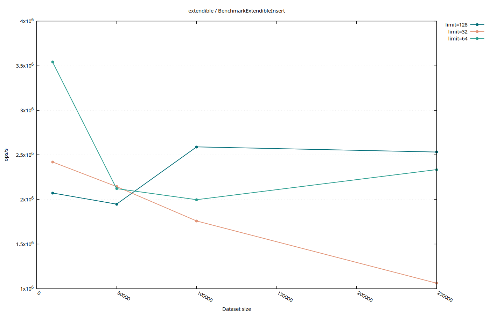

Профили:

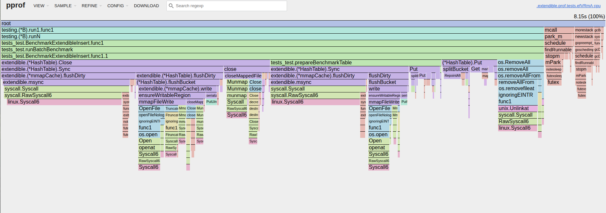
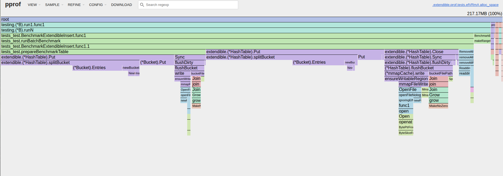

### BenchmarkExtendibleUpdate

| Size | Limit | Runs | Mean ops/s | Mean ns/item |
|---|---:|---:|---:|---:|
| `10000` | `32` | `5` | `5,203` | `192371.80` |
| `10000` | `64` | `5` | `5,154` | `194564.20` |
| `10000` | `128` | `5` | `44,347` | `22575.80` |
| `50000` | `32` | `5` | `5,038` | `198516.80` |
| `50000` | `64` | `5` | `5,093` | `196369.80` |
| `50000` | `128` | `5` | `5,111` | `195729.00` |
| `100000` | `32` | `5` | `4,999` | `200051.40` |
| `100000` | `64` | `5` | `5,028` | `198954.40` |
| `100000` | `128` | `5` | `5,016` | `199398.60` |
| `250000` | `32` | `5` | `4,823` | `207342.20` |
| `250000` | `64` | `5` | `4,929` | `202892.00` |
| `250000` | `128` | `5` | `4,994` | `200270.00` |

Графики:

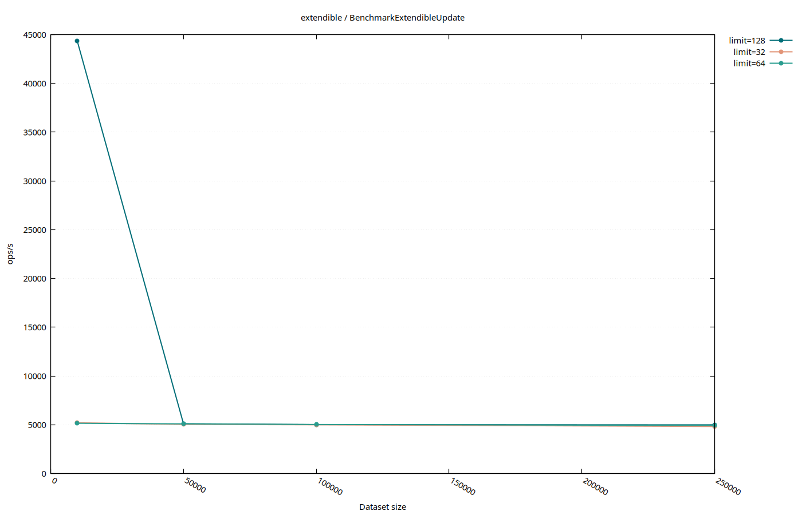

Профили:

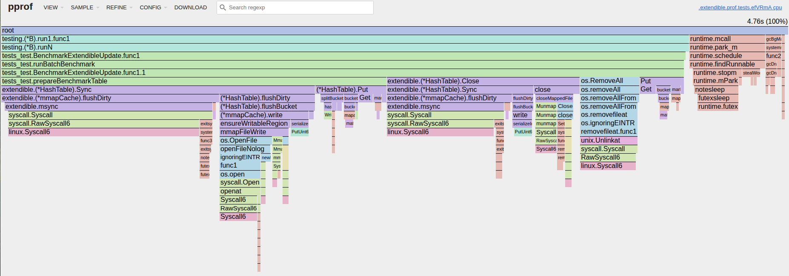
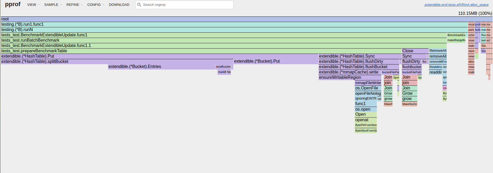

### BenchmarkExtendibleDelete

| Size | Limit | Runs | Mean ops/s | Mean ns/item |
|---|---:|---:|---:|---:|
| `10000` | `32` | `5` | `29,958` | `33522.60` |
| `10000` | `64` | `5` | `72,447` | `14138.40` |
| `10000` | `128` | `5` | `196,563` | `5155.60` |
| `50000` | `32` | `5` | `18,292` | `54686.80` |
| `50000` | `64` | `5` | `19,445` | `51964.00` |
| `50000` | `128` | `5` | `23,999` | `43548.80` |
| `100000` | `32` | `5` | `16,061` | `62444.40` |
| `100000` | `64` | `5` | `17,530` | `57124.60` |
| `100000` | `128` | `5` | `20,796` | `48113.80` |
| `250000` | `32` | `5` | `15,010` | `66630.80` |
| `250000` | `64` | `5` | `15,911` | `62859.80` |
| `250000` | `128` | `5` | `17,796` | `56324.00` |

Графики:

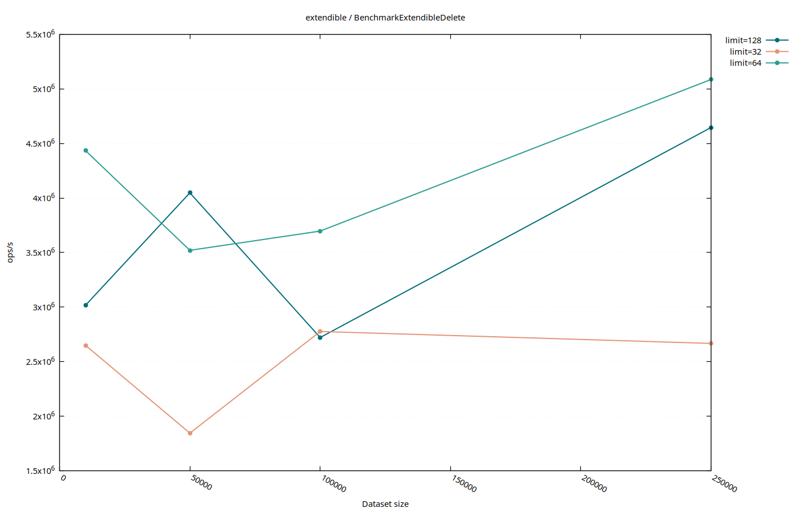

Профили:

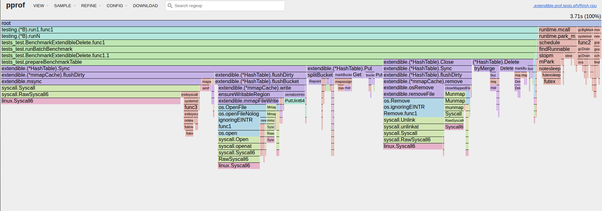
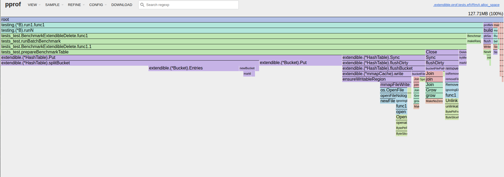

### Вывод по Extendible Hashing

2. Для `Build`, `Insert` и `Delete` на больших размерах `limit=128` остается лучшим из измеренных вариантов.
3. Наиболее плохой сценарий для `Get` — `limit=32`, `size=250000`: `911,933 ops/s`.
4. Лучший `Get` на том же размере — `limit=128`: `2,490,662 ops/s`, то есть примерно в `2.73x` быстрее.
5. `Update` стал самым дорогим mutation-сценарием: на `size=250000` он держится около `4,823-4,994 ops/s` для всех лимитов из-за регулярных flush-точек.

## Профилирование CPU и памяти

### Анализ профилей

#### Perfect Hash

1. CPU в `Build` уходит в построение таблицы, работу с secondary buckets и копирование данных.
2. CPU в `Get` почти полностью сосредоточен в самой lookup-операции.
3. Память в основном расходуется на построение структуры, а не на поиск.

#### LSH

1. Основные затраты CPU приходятся на построение signature и на работу со структурами индекса.
2. Основной memory hotspot — `Index.Add`, потому что именно в этой операции формируются shingles, signature и band buckets.
3. `FindDuplicates` заметно дешевле полного сканирования по времени, но все равно создает много временных структур.

#### Extendible Hashing

1. Для всех операций доминирует `linux.Syscall6`, то есть стоимость системных вызовов и работы с файлами.
2. Основные memory hotspots в профиле — `splitBucket` и чтение `Bucket.Entries`, потому что split и обход bucketов приводят к перераспределению записей.
3. Это подтверждает, что реализация ограничена не столько pure CPU-логикой, сколько файловой подсистемой и схемой синхронизации.
